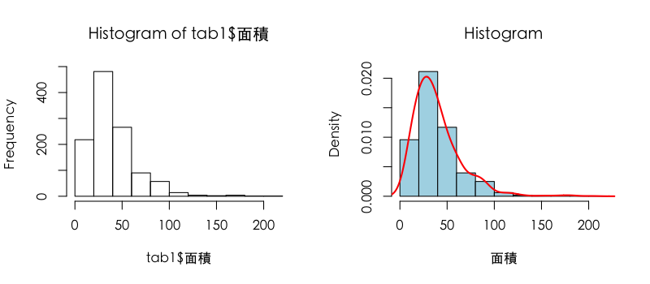

## Links To Slides
### Link to all slides
http://JohnsonHsieh.github.com/dsp-statR

### Source code on github
http://github.com/JohnsonHsieh/dsp-statR/

--- .segue .dark
## Intro R basic (conti.)

---
## 基礎教學

```r
# dat <- read.csv("http://johnsonhsieh.github.io/dsp-introR/data/hsb.csv")
dat <- read.csv("data/hsb.csv")
str(dat) # show dataset structure
```

```
'data.frame':	200 obs. of  11 variables:
 $ id     : int  70 121 86 141 172 113 50 11 84 48 ...
 $ sex    : Factor w/ 2 levels "female","male": 2 1 2 2 2 2 2 2 2 2 ...
 $ race   : Factor w/ 4 levels "African American",..: 4 4 4 4 4 4 1 3 4 1 ...
 $ ses    : int  1 2 3 3 2 2 2 2 2 2 ...
 $ schtyp : Factor w/ 2 levels "private","public": 2 2 2 2 2 2 2 2 2 2 ...
 $ prog   : Factor w/ 3 levels "academic","general",..: 2 3 2 3 1 1 2 1 2 1 ...
 $ read   : int  57 68 44 63 47 44 50 34 63 57 ...
 $ write  : int  52 59 33 44 52 52 59 46 57 55 ...
 $ math   : int  41 53 54 47 57 51 42 45 54 52 ...
 $ science: int  47 63 58 53 53 63 53 39 58 50 ...
 $ socst  : int  57 61 31 56 61 61 61 36 51 51 ...
```


---
## Homework

```r
# Q:男女生考試總分的平均成績誰比較高，高多少分
# Hint:
score <- dat[, c("read","write","math","science","socst")]
mean(dat[dat$sex=="female", "math"])
mean(dat[dat$sex=="male", "math"])
sum()
```


---
## Homework

```r
# Q:男女生考試總分的平均成績誰比較高，高多少分
# A1:
score <- dat[, c("read","write","math","science","socst")]
F <- sum(score[dat$sex=="female",])/sum(dat$sex=="female")
M <- sum(score[dat$sex=="male",])/sum(dat$sex=="male")
F - M
```

```
[1] 1.82
```


---
## Homework

```r
# Q:男女生考試總分的平均成績誰比較高，高多少分
# A2:
score <- dat[, c("read","write","math","science","socst")]
total <- score[,1]+score[,2]+score[,3]+score[,4]+score[,5]
F <- mean(total[dat$sex=="female"])
M <- mean(total[dat$sex=="male"])
F - M
```

```
[1] 1.82
```


---
## Labeling Categorical Vars

```r
?factor
race <- factor(dat$race, 
               levels = c("Hispanic", "Asian", "African American", "White"), 
               labels = c("HI", "AS", "AA", "WH"))
head(race, n=10)
```

```
 [1] WH WH WH WH WH WH AA HI WH AA
Levels: HI AS AA WH
```

```r
race2 <- factor(dat$race, 
               levels = c("African American", "White"), 
               labels = c("B", "W"))
head(race2, n=10)
```

```
 [1] W    W    W    W    W    W    B    <NA> W    B   
Levels: B W
```


--- 
## Sorting Data

```r
dat <- dat[order(dat$id, dat$sex), ] # sort data by id and sex
head(dat)
```

```
    id    sex     race ses schtyp       prog read write math science socst
99   1 female Hispanic   1 public vocational   34    44   40      39    41
139  2 female Hispanic   2 public vocational   39    41   33      42    41
84   3   male Hispanic   1 public   academic   63    65   48      63    56
112  4 female Hispanic   1 public   academic   44    50   41      39    51
76   5   male Hispanic   1 public   academic   47    40   43      45    31
149  6 female Hispanic   1 public   academic   47    41   46      40    41
```


---
## Merging Data
- Use rbind or cbind

```r
dat$score <- rowSums(dat[,7:11]) # read + write + math + science + socst
# rowSums, colSums, rowMeans, colMeans
str(dat$score)
```

```
 num [1:200] 198 196 295 225 206 215 268 227 244 264 ...
```

```r
dat.female <- dat[dat$sex=="female",]
dat.male <- dat[dat$sex=="male",]
dat.both <- rbind(dat.female, dat.male)
cbind(dim(dat.female), dim(dat.male),dim(dat.both))
```

```
     [,1] [,2] [,3]
[1,]  109   91  200
[2,]   12   12   12
```


--- .segue .dark
## 台北市實價登錄資料

---
## Read data

```r
f <- file("data/dsp-gift-2013-big5/買賣st_A_10109_10109.csv", encoding="big5")
tab <- read.csv(f)
names(tab)
```

```
 [1] "鄉鎮市區"                  "交易標的"                  "土地區段位置.建物區段門牌"
 [4] "土地移轉總面積.平方公尺."  "使用分區或編定"            "非都市土地使用分區"       
 [7] "非都市土地使用地"          "交易年月"                  "交易筆棟數"               
[10] "移轉層次"                  "總樓層數"                  "建物型態"                 
[13] "主要用途"                  "主要建材"                  "建築完成年月"             
[16] "建物移轉總面積.平方公尺."  "建物現況格局.房"           "建物現況格局.廳"          
[19] "建物現況格局.衛"           "建物現況格局.隔間"         "有無管理組織"             
[22] "總價.元."                  "單價.元.平方公尺."         "車位類別"                 
[25] "車位移轉總面積.平方公尺."  "車位總價.元."              "交易標的橫坐標"           
[28] "交易標的縱坐標"           
```


---
## 台北市實價登錄資料

```r
str(tab)
```

```
'data.frame':	1789 obs. of  28 variables:
 $ 鄉鎮市區                 : Factor w/ 12 levels "北投區","大安區",..: 12 8 3 5 11 5 5 5 5 5 ...
 $ 交易標的                 : Factor w/ 5 levels "車位","房地(土地+建物)",..: 2 2 1 2 2 3 2 2 2 2 ...
 $ 土地區段位置.建物區段門牌: Factor w/ 1216 levels "?和段一小段251~300地號",..: 1146 711 305 409 1038 471 411 522 472 455 ...
 $ 土地移轉總面積.平方公尺. : Factor w/ 1358 levels "0","0.04","0.05",..: 445 388 39 1243 53 250 889 424 84 928 ...
 $ 使用分區或編定           : Factor w/ 6 levels "","工","農","其他",..: 6 6 5 2 5 4 6 4 6 5 ...
 $ 非都市土地使用分區       : Factor w/ 2 levels "","住宅區": 1 1 1 1 1 1 1 1 1 1 ...
 $ 非都市土地使用地         : logi  NA NA NA NA NA NA ...
 $ 交易年月                 : int  10107 10108 10107 10108 10108 10108 10108 10108 10107 10107 ...
 $ 交易筆棟數               : Factor w/ 73 levels "土地0建物0車位1",..: 35 12 1 12 35 12 18 12 12 12 ...
 $ 移轉層次                 : Factor w/ 83 levels "","八層","八層，電梯樓梯間",..: 40 64 1 2 30 46 40 46 5 27 ...
 $ 總樓層數                 : int  7 5 NA 13 12 14 5 13 7 12 ...
 $ 建物型態                 : Factor w/ 9 levels "辦公商業大樓",..: 5 4 6 1 9 9 4 9 5 9 ...
 $ 主要用途                 : Factor w/ 9 levels "","工業用","國民住宅",..: 8 8 1 4 6 6 8 8 8 8 ...
 $ 主要建材                 : Factor w/ 10 levels "","鋼骨鋼筋混凝土造",..: 4 4 1 4 4 4 4 4 4 4 ...
 $ 建築完成年月             : int  NA NA NA 980729 780816 971205 770303 880121 730628 960621 ...
 $ 建物移轉總面積.平方公尺. : Factor w/ 1458 levels "0","1,368.1",..: 104 1249 873 906 1218 15 148 1389 940 969 ...
 $ 建物現況格局.房          : int  3 2 0 0 2 2 3 4 2 0 ...
 $ 建物現況格局.廳          : int  2 2 0 1 1 1 2 2 1 1 ...
 $ 建物現況格局.衛          : int  2 2 0 1 1 1 2 2 1 1 ...
 $ 建物現況格局.隔間        : Factor w/ 2 levels "無","有": 2 2 2 2 2 2 2 2 2 2 ...
 $ 有無管理組織             : Factor w/ 2 levels "無","有": 1 1 2 2 2 2 2 2 1 2 ...
 $ 總價.元.                 : num  12800000 8500000 2500000 7180000 13500000 ...
 $ 單價.元.平方公尺.        : int  115094 107472 NA 164093 177335 153819 119420 216516 152771 167742 ...
 $ 車位類別                 : Factor w/ 8 levels "","坡道機械",..: 1 1 6 1 1 2 1 1 1 1 ...
 $ 車位移轉總面積.平方公尺. : num  0 0 41.2 0 0 ...
 $ 車位總價.元.             : int  0 0 2500000 0 0 0 0 0 0 0 ...
 $ 交易標的橫坐標           : int  301899 300232 302457 306708 302639 309249 312050 310272 308604 309514 ...
 $ 交易標的縱坐標           : int  2768591 2769876 2771743 2775061 2771658 2772745 2773989 2774704 2774980 2773492 ...
```


---
## Modifying and Managing Data

```r
tab1 <- tab # 整理資料
tab1$行政區 <- tab1$鄉鎮市區
tab1$車位 <- factor(tab1$交易標的, levels=c("房地(土地+建物)", "房地(土地+建物)+車位"),
                    labels=c("無", "有"))
tab1$型態 <- factor(tab1$建物型態, levels=c("公寓(5樓含以下無電梯)","華廈(10層含以下有電梯)",
                    "住宅大樓(11層含以上有電梯)"), labels=c("公寓","華廈","大樓"))
tab1$房價 <- (tab1$總價.元 - tab1$車位總價.元.)
?sub 
tab1$建物移轉總面積.平方公尺. <- as.numeric(sub("\\,", "",
                                          as.character(tab1$建物移轉總面積.平方公尺.)))
tab1$面積 <- 0.3025*(tab1$建物移轉總面積.平方公尺. - tab1$車位移轉總面積.平方公尺.)
tab1$管理 <- tab1$有無管理組織
tab1$屋齡 <- 103 - tab1$建築完成年月%/%10000
tab1 <- tab1[, c("行政區","型態","房價","面積","屋齡","車位","管理")]
```


---
## Modifying and Managing Data

```r
head(tab1)
```

```
  行政區 型態     房價 面積 屋齡 車位 管理
1 中正區 華廈 12800000 33.6   NA   無   無
2 萬華區 公寓  8500000 23.9   NA   無   無
3 大同區 <NA>        0  0.0   NA <NA>   有
4 內湖區 <NA>  7180000 13.2    5   無   有
5 中山區 大樓 13500000 23.0   25   無   有
6 內湖區 大樓 15500000 25.5    6   有   有
```


---
## Modifying and Managing Data

```r
summary(tab1)
```

```
     行政區      型態          房價               面積           屋齡       車位     管理     
 中山區 :265   公寓:364   Min.   :0.00e+00   Min.   : -16   Min.   : 2    無  :999   無: 785  
 北投區 :261   華廈:321   1st Qu.:7.90e+06   1st Qu.:  14   1st Qu.: 5    有  :560   有:1004  
 內湖區 :237   大樓:621   Median :1.42e+07   Median :  28   Median :16    NA's:230            
 文山區 :152   NA's:483   Mean   :2.92e+07   Mean   :  40   Mean   :18                        
 大安區 :149              3rd Qu.:2.51e+07   3rd Qu.:  45   3rd Qu.:30                        
 中正區 :129              Max.   :6.70e+09   Max.   :4430   Max.   :52                        
 (Other):596                                                NA's   :357                       
```

```r
tab1 <- na.omit(tab1)
tab1 <- tab1[tab1$房價!=0,]
```


--- .segue .dark
## Exploratory Data Analysis

---
## Tabulating Data

```r
?table
table(tab1[,1])
```

```

北投區 大安區 大同區 南港區 內湖區 士林區 松山區 萬華區 文山區 信義區 中山區 中正區 
   186     73     34     56    181     66     61     75    109     51    161     85 
```

```r
table(tab1[,2])
```

```

公寓 華廈 大樓 
 249  302  587 
```


---
## Pivot tables

```r
# install.packages("reshape")
library(reshape)
?cast
cast(tab1, 型態 ~ ., fun.aggregate=mean, value="房價")
```

```
  型態    (all)
1 公寓 13628028
2 華廈 18699187
3 大樓 28207161
```

---
## Pivot tables

```r
cast(tab1, 行政區 ~ ., fun.aggregate=table, value="型態")
```

```
   行政區 公寓 華廈 大樓
1  北投區   37   33  116
2  大安區    9   34   30
3  大同區    7    6   21
4  南港區    9   23   24
5  內湖區   57   48   76
6  士林區   28   24   14
7  松山區   10   19   32
8  萬華區   15   13   47
9  文山區   30   31   48
10 信義區   21    6   24
11 中山區   21   51   89
12 中正區    5   14   66
```

```r
# cast(tab1, 行政區 ~ 管理, fun.aggregate=table, value="型態")
```


---
## 小挑戰
- 請計算台北市各行政區為的平均房價
- 請計算台北市各行政區各種建物型態的房價中位數
- Hint: use cast() function in reshape package, 中位數函數 median()

---
## Bar Chart and Pie Chart
- Ref: http://www.statmethods.net/graphs/, Quick-R

```r
par(family="STHeiti", mfrow=c(1,2)) # Mac 中文字型設定
barplot(sort(table(tab1$行政區), decreasing=TRUE), las=2)
pie(sort(table(tab1$型態), decreasing=TRUE))
```

<div class="rimage center"></div>


---
## Histogram and denstiy
- http://www.stat.columbia.edu/~tzheng/files/Rcolor.pdf, colors in R

```r
par(family="STHeiti", mfrow=c(1,2)) # Mac 中文字型設定
hist(tab1$面積)
hist(tab1$面積, breaks=10, col="lightblue", prob=TRUE, xlab="面積", main="Histogram")
lines(density(tab1$面積, bw=8), col=2, lwd=2)
```

<div class="rimage center"></div>


---
## 小挑戰
- ?hist, ?density
- 改變 hist() 函數中的breaks參數，觀察直方圖的變化
- 改變 density() 函數中的bw參數，觀察機率密度函數的變化

---

```r
par(family="STHeiti", mfrow=c(2,2)) # Mac 中文字型設定
hist(tab1$房價, col="gray")
hist(tab1$面積, col="gold")
hist(log10(tab1$房價), col="darkgreen")
hist(log10(tab1$面積), col="lightgreen")
```

<div class="rimage center"></div>


---
## Scatterplot

```r
par(family="STHeiti", mfrow=c(1,2)) # Mac 中文字型設定
plot(tab1$房價/10^4, tab1$面積, xlab="房價(萬元)", ylab="面積(坪)")
plot(tab1$房價/10^4, tab1$面積, xlab="log房價(萬元)", ylab="log面積(坪)", log="xy")
```

<div class="rimage center"></div>


---
## Line chart

```r
attach(beaver1)
hours <- time %/% 100 + 24*(day - day[1]) + (time %% 100)/60
plot(hours, temp, type="l", main="Body Temperature Series")
```

<div class="rimage center"></div>


---
## Correlation

```r
x <- tab1$房價/10^4
y <- tab1$面積
cor(x, y)
```

```
[1] 0.816
```

```r
cor(log10(x), log10(y))
```

```
[1] 0.874
```


---
## Regression

```r
par(family="STHeiti") # Mac 中文字型設定
plot(x, y, xlab="房價(萬元)", ylab="面積(坪)", log="xy")
fit <- lm(log10(y) ~ log10(x)) # log10.y = -0.85 + 0.73 * log10.x
abline(fit, col=2, lwd=2)
```

<div class="rimage center"></div>


---

```r
summary(fit) 
```

```

Call:
lm(formula = log10(y) ~ log10(x))

Residuals:
    Min      1Q  Median      3Q     Max 
-0.4976 -0.0773  0.0039  0.0869  0.5527 

Coefficients:
            Estimate Std. Error t value Pr(>|t|)    
(Intercept)  -0.8480     0.0393   -21.6   <2e-16 ***
log10(x)      0.7321     0.0121    60.5   <2e-16 ***
---
Signif. codes:  0 '***' 0.001 '**' 0.01 '*' 0.05 '.' 0.1 ' ' 1

Residual standard error: 0.128 on 1136 degrees of freedom
Multiple R-squared:  0.763,	Adjusted R-squared:  0.763 
F-statistic: 3.67e+03 on 1 and 1136 DF,  p-value: <2e-16
```


---
## Prediction

```r
new <- data.frame(x = c(500, 800, 1600, 2500, 5000, 8000))
10^predict(fit, newdata=new)
```

```
    1     2     3     4     5     6 
 13.4  18.9  31.4  43.6  72.4 102.2 
```


---
## Multiple Regression

```r
fit1 <- lm(log10(面積)~log10(房價/10^4),data=tab1)
fit2 <- lm(log10(面積)~log10(房價/10^4)+型態+車位+管理,data=tab1)
fit2
```

```

Call:
lm(formula = log10(面積) ~ log10(房價/10^4) + 型態 + 車位 + 
    管理, data = tab1)

Coefficients:
     (Intercept)  log10(房價/10^4)          型態華廈          型態大樓            車位有  
         -0.6311            0.6762           -0.0734           -0.0631            0.0888  
          管理有  
         -0.0329  
```


---

```r
summary(fit1)
```

```

Call:
lm(formula = log10(面積) ~ log10(房價/10^4), data = tab1)

Residuals:
    Min      1Q  Median      3Q     Max 
-0.4976 -0.0773  0.0039  0.0869  0.5527 

Coefficients:
                 Estimate Std. Error t value Pr(>|t|)    
(Intercept)       -0.8480     0.0393   -21.6   <2e-16 ***
log10(房價/10^4)   0.7321     0.0121    60.5   <2e-16 ***
---
Signif. codes:  0 '***' 0.001 '**' 0.01 '*' 0.05 '.' 0.1 ' ' 1

Residual standard error: 0.128 on 1136 degrees of freedom
Multiple R-squared:  0.763,	Adjusted R-squared:  0.763 
F-statistic: 3.67e+03 on 1 and 1136 DF,  p-value: <2e-16
```


---

```r
summary(fit2)
```

```

Call:
lm(formula = log10(面積) ~ log10(房價/10^4) + 型態 + 車位 + 
    管理, data = tab1)

Residuals:
    Min      1Q  Median      3Q     Max 
-0.4461 -0.0697  0.0056  0.0817  0.5461 

Coefficients:
                 Estimate Std. Error t value Pr(>|t|)    
(Intercept)      -0.63109    0.04382  -14.40  < 2e-16 ***
log10(房價/10^4)  0.67619    0.01396   48.43  < 2e-16 ***
型態華廈         -0.07343    0.01198   -6.13  1.2e-09 ***
型態大樓         -0.06315    0.01243   -5.08  4.4e-07 ***
車位有            0.08883    0.00943    9.42  < 2e-16 ***
管理有           -0.03286    0.00960   -3.42  0.00064 ***
---
Signif. codes:  0 '***' 0.001 '**' 0.01 '*' 0.05 '.' 0.1 ' ' 1

Residual standard error: 0.12 on 1132 degrees of freedom
Multiple R-squared:  0.79,	Adjusted R-squared:  0.789 
F-statistic:  853 on 5 and 1132 DF,  p-value: <2e-16
```


---

```r
anova(fit1, fit2)
```

```
Analysis of Variance Table

Model 1: log10(面積) ~ log10(房價/10^4)
Model 2: log10(面積) ~ log10(房價/10^4) + 型態 + 車位 + 管理
  Res.Df  RSS Df Sum of Sq    F Pr(>F)    
1   1136 18.5                             
2   1132 16.4  4       2.1 36.2 <2e-16 ***
---
Signif. codes:  0 '***' 0.001 '**' 0.01 '*' 0.05 '.' 0.1 ' ' 1
```


---

```r
par(family="STHeiti") # Mac 中文字型設定
cols <- adjustcolor(ifelse(tab1$型態=="公寓", 2, 4), 0.3)
plot(面積 ~ 房價, data=tab1,  col = cols, pch=19, log="xy")
legend("topleft", c("公寓", "華廈+大樓"), pch=19, col=c(2,4), bty="n")
```

<div class="rimage center"></div>


---
## References
- [Introducing R](http://www.ats.ucla.edu/stat/r/seminars/intro.htm), UCLA R seminars
- [R的資料型態](http://rpubs.com/wush978/R_DataType), TW R User Group
- [Quick R graphs](http://www.statmethods.net/graphs/), Quick R
- [免費電子書 -- R 統計軟體](http://ccckmit.wikidot.com/r:main), 陳鍾誠的網站
- [StackOverflow](http://stackoverflow.com/), getting help online
